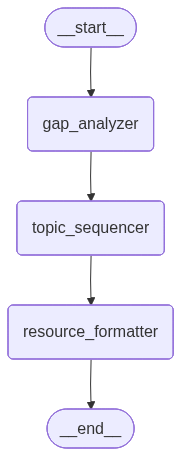

# LangGraph Learning Path Generator – Architectural Notes



## High-Level Flow

- `app.py` hosts the Streamlit front-end: collects persona presets, pacing inputs, runs the LangGraph workflow via a cached helper, and renders rich outputs (editor, schedule, PDF export, ICS calendar, embeddable resources, progress tracking).
- `graph.py` defines the “brain”: a LangGraph state machine composed of three Gemini-powered nodes (gap analysis → sequencing → resource formatter) that return structured `RoadmapStep` objects.
- State passes as a `PathState` typed dict, ensuring every node receives the same context (skills, goal, pacing constraints, raw topics, and final structured path). The diagram above visualizes this linear flow.

## End-to-End Data Lifecycle

1. **Input capture** – The user selects a preset persona or enters a custom goal/skills list, timeline target, study cadence (days/week), and focus hours/day. Streamlit session state keeps these values sticky between reruns.
2. **State assembly** – Inputs are normalized (skills split by comma, hours multiplied to weekly capacity) and packed into a `PathState`.
3. **Cached LangGraph run** – `run_cached_workflow` (decorated with `@st.cache_data`) serializes the `PathState` into a deterministic key so identical inputs reuse the previous Gemini output instantly.
4. **LLM pipeline** – LangGraph executes the three Gemini nodes, gradually augmenting the state (`raw_topic_list` → ordered topics → structured `learning_path`).
5. **Post-processing** – `format_roadmap_steps` strips `[High Leverage]` tags, ensures every step carries a normalized URL, and prepares dicts for UI editing.
6. **User customization** – `st.data_editor` lets the user reprioritize topics, tweak time estimates, and override URLs/confidence before the downstream components render.
7. **Visualization & exports** – The customized plan feeds the collapsible modules, metrics, schedule/ICS, PDF writer, and download buttons.

## `graph.py` Details

- **Environment setup**: Loads `.env` (via `load_dotenv`) and instantiates `ChatGoogleGenerativeAI` (`gemini-2.5-flash`). If `GEMINI_API_KEY` is missing, `llm` is set to `None` and the workflow becomes a no-op (Streamlit shows the configuration warning).
- **Data models**:
  - `RoadmapStep`: normalized schema for the final roadmap. Includes description, URL, difficulty, time estimate, confidence, and whether it was tagged `[High Leverage]`.
  - `PathState`: LangGraph state definition ensuring the LLM nodes can pass/share context.
- **LangGraph nodes & prompts**:
  1. `skill_gap_analyzer`  
     Prompt excerpt: “You are an expert career counselor… Focus only on knowledge gaps. Return a comma-separated list of topics, nothing else.” The response is split on commas to create `raw_topic_list`. In mock/offline mode it returns deterministic placeholder topics.
  2. `topic_sequencer`  
     Prompt excerpt: “Order these topics logically… Return the final list as a numbered list (1., 2., 3., etc.).” Each numbered line is stripped into the revised `raw_topic_list`. Mock mode mirrors a simple prerequisite flow.
  3. `resource_finder_and_formatter`  
     Uses `llm.with_structured_output(FinalPath, method="json_mode")`. The prompt injects pacing info, the selected **mentor persona** (generalist coach, academic advisor, etc.), and the learner’s **resource preference** (video, reading, docs, mixed). It must emit descriptions, fully-qualified HTTPS URLs, 10/20-hour increments, difficulty labels, and confidence scores while tagging `[High Leverage]` priorities. If parsing fails, a fallback list of placeholder `RoadmapStep` objects is created so the UI can still render.
  4. `post_process_learning_path`  
     Normalizes casing, clamps difficulty to the supported enum, enforces HTTPS, deduplicates repeated entries, and bounds confidence/time estimates. Guarantees every entry hydrates a valid `RoadmapStep`.
- **Graph wiring**: a `StateGraph` with entry point `gap_analyzer` and linear edges through `topic_sequencer` to `resource_formatter`, ending at `END`. `app = build_path_graph()` compiles the runnable workflow for import.

## `app.py` Details (Deep Dive)

- **Imports & globals**: besides Streamlit/Pandas, the app brings in LangGraph drawing helpers, FPDF, temp-file utilities, YouTube regex helpers, ICS generation helpers, and an optional Pyppeteer availability flag. A persona preset library, PDF theme palette, and defaults are defined at the top.
- **Session state initialization**: ensures preset values persist across reruns (goal, skills, pacing sliders, theme, completion tracking).
- **Graph visualization**:
  - `_cached_graph_image` stores the rendered PNG via `@st.cache_data` (1h TTL) to avoid repeated Mermaid calls.
  - `get_graph_image_data` first tries Mermaid’s hosted API with configurable retries; if repeated failures and `pyppeteer` is installed, it renders locally, otherwise it surfaces a user-facing warning with install instructions.
- **PDF generation**:
  - Uses `FPDF` with customizable themes and highlight rows for `[HL]` topics.
  - Renders to a temporary file to avoid byte/encoding issues, then reads raw bytes for `st.download_button`.
  - Includes pacing summary, highlight icons, and a confidence column. Resource URLs are appended under the resource description to make the PDF actionable.
- **Caching LangGraph runs**: `@st.cache_data` wraps `run_cached_workflow`. Identical inputs reuse the cached `PathState`, saving LLM calls and improving UX. Cache keys include goal, tuple of skills, cadence, and target days, so editing any input forces a new run.
- **ICS & schedules**: `generate_weekly_breakdown` partitions topics by user weekly capacity; `generate_weekly_ics` exports an iCal payload for calendar reminders.
- **Resource helpers**:
  - `extract_first_url`, `normalize_url`, `is_youtube_url`, `to_youtube_embed` guarantee clickable links and embeddable videos even if the LLM returns “www.youtube.com/…” or `youtu.be` links.
  - `format_roadmap_steps` converts each `RoadmapStep` into a dict the UI can manipulate safely, while preserving leverage flags.
- **Streamlit layout & user journey**:
  - **Sidebar**: persona preset loader, text inputs, pacing sliders, mentor persona selector, resource-preference selector, theme selector, onboarding wizard, graph snapshot.
  - **Workflow invocation**: “Generate Roadmap” calls `run_cached_workflow`. Status container logs each LangGraph phase so the user can see progress/spinners. If the app is in mock mode (`USE_MOCK=true`), the UI informs the user and still allows generation without an API key.
  - **Editor**: `st.data_editor` exposes priority, difficulty, resource text/URL, estimated hours, focus label, and confidence. Column config enforces valid ranges and allows adding/removing rows. Validation stops execution if all rows are deleted.
  - **Collapsible modules**: each topic expander shows leverage status, difficulty, time, confidence, resource description, embedded video (if the URL is YouTube), and an “Open resource” link button.
  - **Metrics/progress**: timeline metrics, progress bar, success/warning messaging about pacing, completion checkboxes, remaining schedule summary.
  - **Tabs**:
    - Priority tab surfaces high-leverage topics first.
    - Schedule tab lists weekly groupings and provides an ICS download button for calendar import.
    - Data tab shows the entire dataset with conditional formatting (difficulty vs focus).
  - **Exports**: PDF download (theme aware) and ICS download (from schedule tab).

## Configuration & Dependencies

| Purpose                 | Requirement                                        | Notes                                                                                                        |
| ----------------------- | -------------------------------------------------- | ------------------------------------------------------------------------------------------------------------ |
| LLM                     | `GEMINI_API_KEY` environment variable              | Load via `.env` or OS env. If absent and `USE_MOCK=true`, the app serves deterministic sample data.          |
| Mock mode               | `USE_MOCK=true`                                    | Skips LLM calls entirely; useful for offline demos/tests.                                                    |
| Diagram fallback        | `pyppeteer` (optional)                             | `pip install pyppeteer` enables local Mermaid rendering when the hosted API fails (image cached for 1 hour). |
| Streamlit runtime       | Python 3.10+ with packages from `requirements.txt` | Includes Streamlit, LangChain, LangGraph, Pandas, FPDF, etc.                                                 |
| Browser video embedding | Valid HTTPS resource URLs                          | Prompts enforce HTTPS; `normalize_url` re-adds the scheme if missing so embeds render correctly.             |

**Local run**

```
pip install -r requirements.txt
setx GEMINI_API_KEY "sk-proj-..."   # Windows PowerShell
# or export GEMINI_API_KEY=... on macOS/Linux
streamlit run app.py
```

Add `pyppeteer` if you want reliable local graphs:

```
pip install pyppeteer
```

## `app.py` Details

- **Imports & globals**: besides Streamlit/Pandas, the app brings in LangGraph drawing helpers, FPDF, temp-file utilities, and helper regexes for detecting resource URLs. A persona preset library, PDF theme palette, and defaults are defined at the top.
- **Session state initialization**: ensures preset values persist across reruns (goal, skills, pacing sliders, theme, completion tracking).
- **Graph visualization**:
  - `get_graph_image_data` first tries Mermaid’s hosted API with retries.
  - If repeated failures and `pyppeteer` is installed, it renders locally; otherwise it warns the user to `pip install pyppeteer`.
- **PDF generation**:
  - Uses `FPDF` with customizable themes and highlight rows for `[HL]` topics.
  - Renders to a temporary file to avoid byte/encoding issues, then reads raw bytes for `st.download_button`.
  - Includes pacing summary + confidence column.
- **Caching LangGraph runs**: `@st.cache_data` wraps `run_cached_workflow`. Identical inputs reuse the cached `PathState`, saving LLM calls and improving UX.
- **ICS & schedules**: `generate_weekly_breakdown` partitions topics by user weekly capacity; `generate_weekly_ics` exports an iCal payload for calendar reminders.
- **Resource helpers**:
  - `extract_first_url`, `normalize_url`, `is_youtube_url`, `to_youtube_embed` guarantee clickable links and embedded videos.
  - `format_roadmap_steps` converts each `RoadmapStep` into a dict the UI can manipulate safely.
- **Streamlit layout**:
  - Sidebar collects inputs (preset loader, goal/skills, pacing sliders, PDF theme, onboarding wizard, graph image).
  - On “Generate”, user inputs are normalized, then `run_cached_workflow` is invoked. If `llm` is `None` a configuration error is shown.
  - Main area:
    - Editor: `st.data_editor` lets the user reprioritize topics, adjust resources, set URLs, tweak hours/confidence. Validation ensures at least one topic remains.
    - Collapsible modules: each topic shows difficulty, leverage tag, embedded YouTube video, and link button.
    - Metrics/progress: timeline metrics, progress bar, success/warning messaging about pacing, completion checkboxes, remaining schedule summary.
    - Tabs: Priority (high leverage vs supporting), Schedule (weekly plan + ICS download), Data (styled dataframe).
    - Exports: themeable PDF plus weekly ICS download button.

## Diagram

The image `docs/langgraph_workflow.png` (generated via `py -3 -c ...` script) shows the three-node LangGraph sequence described above. Update it any time the workflow changes by re-running:

```
py -3 -c "from pathlib import Path; from langchain_core.runnables.graph import CurveStyle, NodeStyles; from graph import app; out=Path('docs'); out.mkdir(exist_ok=True); img=app.get_graph().draw_mermaid_png(curve_style=CurveStyle.LINEAR, node_colors=NodeStyles(first='#ffc0cb', last='#90ee90', default='#add8e6')); (out/'langgraph_workflow.png').write_bytes(img)"
```

## Shortcomings & Known Limitations

- **LLM availability**: Mock mode prevents crashes when `GEMINI_API_KEY` is missing, but those outputs are simplistic and should be clearly labeled as demo data.
- **Mermaid/Pyppeteer dependency**: Diagram rendering still depends on either a working internet connection or having `pyppeteer` installed (which downloads Chromium on first launch). There’s no intermediate “ASCII diagram” fallback yet.
- **Resource validation**: URLs are accepted as-is; there’s no live HEAD request to verify the link, ensure HTTPS certificates are valid, or confirm content type (video/article/course). Embedded YouTube relies on the URL actually being a video.
- **LLM determinism**: Gemini may produce varying `[High Leverage]` tags, estimated times, or confidence scores; caching helps but editing a single parameter forces a full re-run. There is no versioning of previous roadmaps.
- **Accessibility**: Streamlit UI is heavily visual. Screen-reader support, keyboard navigation, and color-contrast options have not been optimized/tested.
- **No backend persistence**: Edits are session-based only. Closing the tab loses customizations unless the PDF/ICS is saved externally.
- **Limited testing**: Prompts and parsing functions rely on runtime behavior. There are no unit/integration tests ensuring changes don’t break the structured output contract or normalization layer.
- **Mock fidelity**: Offline mode currently emits generic placeholders; it does not yet tailor content to persona/resource preferences or pacing constraints.

## Improvement Ideas & Reusable Extensions

- **Pluggable LLM adapters**: Abstract `ChatGoogleGenerativeAI` behind an interface to swap in OpenAI, Claude, or local models without touching the graph nodes.
- **Persistent storage**: Add Supabase/Firebase logging for user sessions so edited roadmaps can be saved, shared, or versioned.
- **Validation middleware**: Introduce a post-processing node that validates URLs, enforces hour caps, or deduplicates topics before returning to Streamlit.
- **Multi-tenant presets**: Load preset personas from YAML/JSON so teams can contribute libraries without code edits.
- **API endpoint**: Expose the LangGraph workflow via FastAPI so other front-ends (mobile, Slack bots) can reuse it.
- **Testing harness**: Unit-test prompts by snapshotting Gemini responses or mocking `llm` to ensure downstream parsing doesn’t regress.
- **Dynamic visuals**: Replace static PDF tables with embedded charts (Plotly) or export to PowerPoint/Canva templates for richer stakeholder presentations.
- **Collaboration features**: Add shareable links, team comments, or integration with project trackers (Jira/Linear) so the roadmap can drive sprint planning.
- **Gamification hooks**: Connect the progress tracker to streak counters, badges, or reminder emails/SMS for learner accountability.

These notes should help future contributors understand how the current system is wired, where the data flows, and which areas are ripe for expansion.
